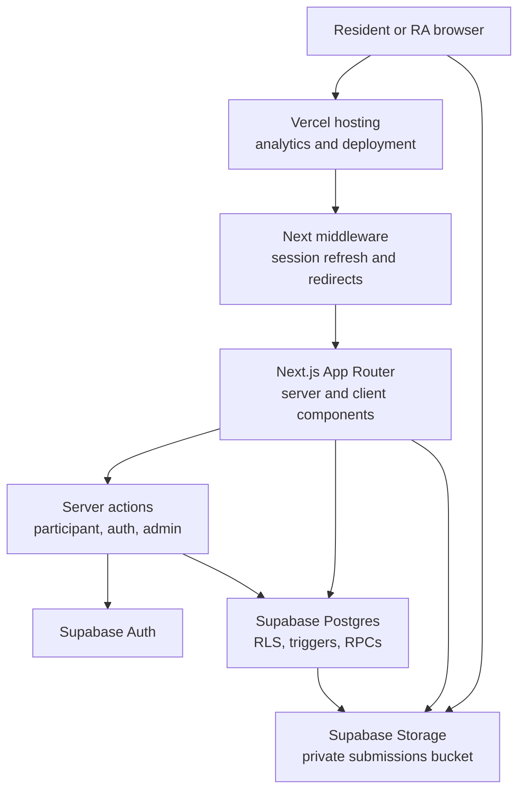
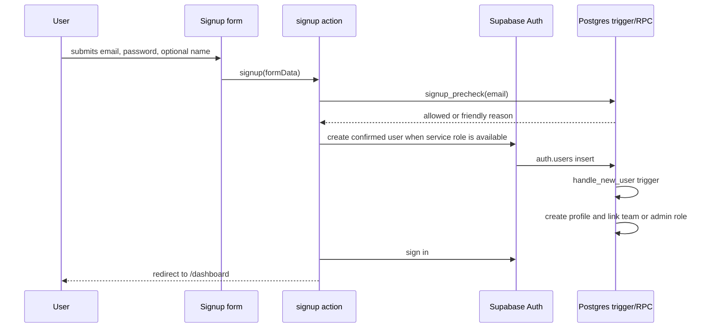
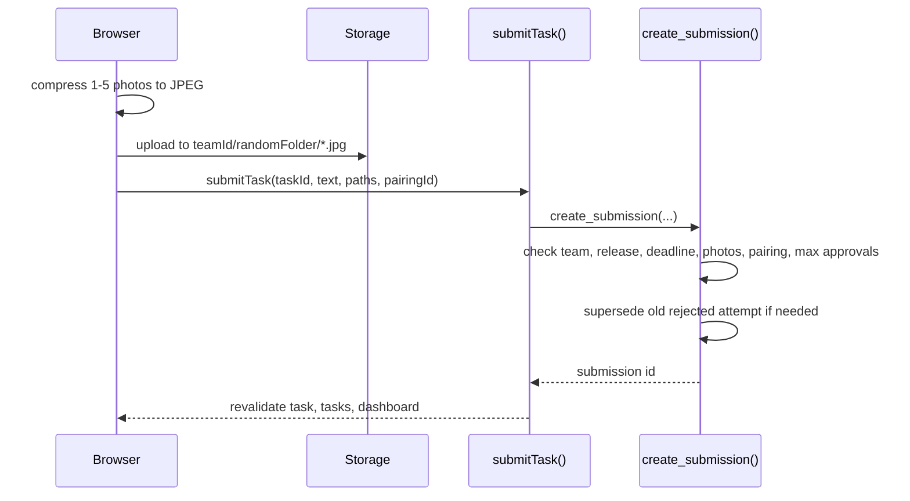

# PGPals System Design

This document describes the current implementation of PGPals. It is intended
as the architectural reference for future changes, not as a wishlist or a
planning prompt.

## 1. Product Scope

PGPals is a two-week PGPR buddy challenge app. Residents sign up with an
approved email, are linked to a pre-assigned team, complete photo tasks, and
earn PGP Coins after RA review. Admins manage the event setup, teams, tasks,
announcements, reviews, bonuses, and leaderboard.

The application is optimized for roughly 400 residents and free-tier-friendly
infrastructure:

- Next.js App Router handles UI, routing, server components, and server actions.
- Supabase provides Postgres, Auth, Row Level Security, RPCs, and private
  Storage.
- Vercel hosts the app and runs Web Analytics.

The key design principle is that the database is the security boundary. UI
checks are for usability only. RLS policies, triggers, and RPCs enforce the
important rules.

## 2. High-Level Architecture



Primary request paths:

- Public visitor: `/` renders landing content and public event dates.
- Authenticated participant: `(app)` routes read through the user's Supabase
  session, so RLS limits data to their team.
- Admin: `/admin` routes require an admin profile and still query through the
  admin's own session. Admin privileges are enforced by RLS and admin-only RPCs.
- Photo upload: the browser uploads compressed images directly to Supabase
  Storage, then a server action records the storage paths through an RPC.

## 3. Runtime Boundaries

### Browser

The browser handles interactive forms, image compression, previews, toasts, and
direct Storage uploads. It is not trusted for authorization, deadlines, score
calculation, team membership, or review decisions.

Important browser components:

- `src/components/pgpals/submission-form.tsx`
- `src/components/pgpals/pair-panel.tsx`
- `src/app/admin/review/review-card.tsx`
- `src/app/admin/tasks/task-form.tsx`
- `src/app/admin/teams/teams-toolbar.tsx`
- `src/app/admin/settings/settings-form.tsx`

### Next.js Server

The Next.js server layer provides:

- Route guards and redirects through `requireProfile()` and `requireAdmin()`.
- Read-heavy server components for pages and dashboards.
- Server actions for mutations and cache invalidation.
- Private service-role utilities for cases where the server must bypass RLS
  after an RLS-checked read, such as signed photo URLs.

The server does not duplicate security rules. It calls database functions that
re-check the rules.

### Supabase

Supabase owns:

- Auth identity.
- Postgres tables and constraints.
- RLS policies.
- Triggers for signup/profile creation.
- RPCs for participant submissions, pair invites, admin reviews, scoring, and
  leaderboard visibility.
- Private Storage for submission photos.

## 4. Source Map

| Area | Files |
| --- | --- |
| Public landing | `src/app/page.tsx` |
| Root layout, fonts, analytics | `src/app/layout.tsx`, `src/app/globals.css` |
| Auth pages and actions | `src/app/(auth)/*`, `src/app/auth/callback/route.ts` |
| Participant app shell | `src/app/(app)/layout.tsx` |
| Dashboard | `src/app/(app)/dashboard/page.tsx` |
| Tasks and task detail | `src/app/(app)/tasks/page.tsx`, `src/app/(app)/tasks/[id]/page.tsx` |
| Leaderboard | `src/app/(app)/leaderboard/page.tsx` |
| Participant actions | `src/app/(app)/actions.ts` |
| Admin shell and pages | `src/app/admin/*` |
| Admin actions | `src/app/admin/actions.ts` |
| Shared product UI | `src/components/pgpals/*` |
| shadcn-style primitives | `src/components/ui/*` |
| Supabase clients | `src/lib/supabase/*` |
| Shared loaders/helpers | `src/lib/data.ts`, `src/lib/photos.ts`, `src/lib/datetime.ts`, `src/lib/status.ts`, `src/lib/bonus.ts` |
| Row types | `src/lib/types.ts` |
| Database schema/security | `supabase/migrations/*` |
| Seed/backup/test scripts | `scripts/*` |

## 5. Data Model

The source of truth is `supabase/migrations/20260702000000_init.sql`, plus the
later migrations in the same directory (scalability hardening, roster-only
signup, member regrouping).

Core tables:

| Table | Purpose |
| --- | --- |
| `teams` | Team identity and editable team name. |
| `profiles` | App profile for each Supabase Auth user. Links users to teams and roles. |
| `roster` | Pre-assigned resident emails and names, imported by admins. |
| `tasks` | Task content, timing, points, type, publish state, and bonus config. |
| `pairings` | Pair-task invite and accepted pairing state between two teams. |
| `submissions` | Team proof submissions, photo storage paths, review state, points awarded. |
| `bonus_awards` | Manual admin-granted point adjustments with a reason. |
| `announcements` | Admin-posted resident announcements. |
| `event_settings` | Singleton row for event name, dates, and leaderboard hide date. |
| `admin_allowlist` | RA emails that become admins at signup; managed in Admin -> Settings. |

Important type choices:

- User-facing copy says "PGP Coins"; database identifiers still say `points`.
- Scores are computed, not stored.
- Photos are stored as private Storage object paths in `submissions.photo_paths`.
- `submissions.status` can be `pending`, `approved`, `rejected`, or
  `superseded`. `superseded` marks an old rejected attempt that has been
  replaced by a resubmission.

## 6. Auth and Signup Flow



Rules:

- `.test` demo emails are rejected in hosted signup flows.
- `signup_precheck(email)` gives user-friendly errors before creating an Auth
  user.
- `handle_new_user()` is authoritative. It only creates a profile when the email
  is in `admin_allowlist` or `roster`; there is no other signup path.
- Rostered users are linked to their pre-assigned team.
- Admin allowlisted users become admins on signup.
- Password recovery uses `/auth/callback` to exchange the Supabase recovery code
  and redirect to `/reset-password`.

## 7. Routing and Access Control

`src/middleware.ts` refreshes the Supabase session and performs UX redirects:

- Logged-out users are sent to `/login` for protected pages.
- Logged-in users visiting `/`, `/login`, `/signup`, or `/forgot-password` are
  sent to `/dashboard`.
- `/auth/callback` is allowed through for password recovery.

Route guards:

- `requireProfile()` loads the current user and their profile or redirects to
  `/login`.
- `requireAdmin()` calls `requireProfile()` and redirects non-admins to
  `/dashboard`.

These guards are not the security boundary. Direct data access remains limited
by RLS and RPC checks.

## 8. Participant Features

### Dashboard

`/dashboard` is team-scoped.

- Teamless users see announcements and event dates only.
- Teamless admins also get a pointer to the admin console.
- Teamed participants see team info, current score, approved count, to-do count,
  rejected tasks that need fixes, open tasks, in-review tasks, announcements,
  leaderboard link, coin history, and event dates.

Data comes from `teams`, `profiles`, `roster`, `announcements`, `tasks`,
`submissions`, `bonus_awards`, `get_my_score()`, and `event_settings`.

### Tasks

`/tasks` groups tasks into:

- Closing soon.
- Open.
- Done.
- Closed.

"Done" means all allowed approvals have been used for that team. Repeatable
tasks stay open until `max_submissions` approved submissions are reached.

`/tasks/[id]` shows the task, bonus explanation, pair controls, submission form,
and submission history. It reads submissions through RLS, then calls
`getSignedPhotoUrls()` for visible photo paths.

### Submissions



The database RPC enforces:

- User must be on a team.
- Task must exist, be published, and be released.
- Deadline must not have passed.
- Photo count must be 1 to 5.
- Storage paths must start with the user's team id.
- Pair tasks require an accepted pairing involving the user's team.
- Standard tasks cannot carry a pairing.
- A team cannot submit when an item is already pending for that task.
- A team cannot exceed the task's approved submission limit.

## 9. Pair Tasks

Pair tasks use RPC-only writes:

- `available_partner_teams(p_task)` returns teams not already pending or
  accepted for that task.
- `create_pair_invite(p_task, p_partner)` creates a pending invite.
- `respond_pair_invite(p_pairing, p_accept)` accepts or declines.
- `cancel_pair_invite(p_pairing)` lets the inviting team cancel a pending
  invite.

When a pair submission is approved, `team_score(team_id)` credits both teams by
including approved submissions where the team is the submitter or either side
of the accepted pairing.

## 10. Admin Features

All admin pages are inside `src/app/admin` and use `requireAdmin()`.

### Overview

`/admin` shows pending review count, today's submissions, participation, live
task count, oldest pending submissions, and quick actions.

### Review Queue

`/admin/review` is the primary admin surface.

- Tabs show pending, approved, rejected, and superseded submissions.
- Task/team filters are preserved across tabs.
- Oldest pending submissions appear first.
- Cards show signed photo URLs, text, team, task, time, bonus preview, and
  review controls.

`reviewSubmission()` calls the `review_submission` RPC. The RPC:

- Requires admin role through `is_admin()`.
- Locks the submission row.
- Requires pending status.
- Computes authoritative points through `compute_award()` unless an override is
  supplied.
- Requires a rejection reason for rejected submissions.
- Writes reviewer, reviewed time, status, note, and awarded points.

`revertReview()` calls `revert_review()` to move approved or rejected items back
to pending when an admin misclicks.

### Task Management

`/admin/tasks` lists tasks with publish state, release/deadline, approved count,
pending count, pair badge, and bonus badge.

`/admin/tasks/new` and `/admin/tasks/[id]` use `TaskForm` for create, update,
and delete. Datetime inputs are interpreted as Singapore time and converted to
UTC before being stored.

Bonus config is stored in `tasks.bonus_config`:

- `first_n`: first N approved submissions get extra coins.
- `before`: submissions before a cutoff get extra coins.
- `multiplier_before`: submissions before a cutoff multiply base coins.

The review page mirrors `compute_award()` for display only. The database
function is authoritative.

### Team Management

`/admin/teams` lists teams, roster members, signup status, and score.

Admins can:

- Import a CSV roster.
- Create teams manually.
- Rename or delete teams.
- Add or remove roster members.
- Move a member to another team (regrouping via the `move_roster_member`
  RPC, which updates the roster entry and any signed-up profile in one
  transaction; earned coins stay with the old team).
- Grant manual bonus awards with a reason.

Roster changes also update matching profiles when a user has already signed up.

### Announcements

`/admin/announcements` supports create, update, pin/unpin, and delete. The
participant dashboard reads recent announcements ordered by pinned state and
created time.

### Settings

`/admin/settings` edits the singleton `event_settings` row:

- Event name.
- Start and end date.
- Leaderboard hide date.

It also manages `admin_allowlist`: RA emails added there become admins at
signup, and adding an email that already has an account promotes it right
away. The prize messaging is not a setting; it is hardcoded in
`src/lib/prizes.ts`.

## 11. Scoring and Leaderboard

Scores are derived at read time:

- `team_score(team_id)` sums approved submission points where the team is the
  submitter or a paired partner.
- It also adds manual `bonus_awards`.
- It is revoked from direct public execution so participants cannot reconstruct
  hidden standings.

Exposed score RPCs:

- `get_my_score()` returns the current user's team score.
- `get_leaderboard()` returns ranked teams unless the caller is a participant
  after `leaderboard_hide_at`.

Leaderboard tie-break:

1. Higher score first.
2. Earlier last-scored time first.
3. Team name.

Admins can still see the leaderboard after the hide date. Participants receive
an empty result and the UI shows the hidden state.

## 12. Photo Storage

Storage bucket:

- Bucket name: `submissions`.
- Private bucket.
- File size limit: 2 MB.
- Allowed MIME types: JPEG, PNG, WebP.

Upload path convention:

```text
<team_id>/<random_submission_folder>/<photo_number>.jpg
```

The browser compresses photos before upload to reduce free-tier storage use.
Storage RLS allows authenticated users to upload only under their own team
folder.

Reads:

- Direct Storage reads are allowed for the owning team and admins.
- Pair partners and review/detail views use server-generated signed URLs after
  the page has already read the submission row through RLS.
- `src/lib/photos.ts` uses the service-role client for signed URLs only.

## 13. Supabase Client Strategy

| Client | File | Use |
| --- | --- | --- |
| Browser session client | `src/lib/supabase/client.ts` | Client components and direct Storage upload. |
| Server session client | `src/lib/supabase/server.ts` | Server components and server actions using the current user's session. |
| Service-role client | `src/lib/supabase/admin.ts` | Server-only operations that must bypass RLS, such as signed URLs and confirmed Auth user creation. |

`admin.ts` imports `server-only` and must never be imported into client
components.

Canonical env vars:

- `NEXT_PUBLIC_SUPABASE_URL`
- `NEXT_PUBLIC_SUPABASE_PUBLISHABLE_KEY`
- `SUPABASE_SERVICE_ROLE_KEY`

`SUPABASE_DB_PASSWORD` is for CLI database maintenance only and is not a Vercel
runtime variable.

## 14. Cache and Revalidation

The app relies on server-rendered pages and targeted revalidation after
mutations.

Examples:

- Submitting a task revalidates the task detail page, `/tasks`, and
  `/dashboard`.
- Admin review revalidates the admin layout and public/app layout-level views
  that show scores.
- Task create/update/delete revalidates admin pages and participant task pages.
- Announcement changes revalidate admin pages and `/dashboard`.
- Settings changes revalidate admin pages and layout-level public views.

This keeps the implementation simple at event scale. There is no separate
client cache layer.

## 15. Security Model

The database enforces the important rules:

- RLS is enabled on app tables and Storage objects.
- Participants cannot directly insert or update `submissions` or `pairings`.
- Participants write submissions and pairings only through RPCs that re-check
  team, release, deadline, pairing, path, pending, and max-approval rules.
- Admin review uses an admin-only RPC that computes points in the database.
- Leaderboard hiding is enforced in `get_leaderboard()`, not just the UI.
- Service-role access is isolated to server-only helpers.
- Storage paths are validated by RPC before they are recorded in submissions.

Database helpers:

- `is_admin()`
- `my_team_id()`
- `pairing_involves_me()`
- `is_service_role()`

Update guards:

- `guard_profile_update()` prevents participants from changing role, team, email,
  or id.
- `guard_team_update()` prevents participants from changing team fields other
  than the team name.

## 16. Design System

The app uses the "Playful Geometric" design system defined in
`src/app/globals.css`.

Key conventions:

- Warm cream background, slate ink, vivid violet primary.
- Semantic state colors for success, warning, and destructive states.
- Hard ink borders and pop shadows for buttons/cards.
- Outfit headings and Plus Jakarta Sans body text.
- Mobile-first participant views.
- Dense, scannable admin views.
- No dark mode.

Domain components live in `src/components/pgpals`. Generic primitives live in
`src/components/ui`.

## 17. Scripts and Operations

| Script | Purpose |
| --- | --- |
| `npm run dev` | Local Next dev server. |
| `npm run build` | Production build. |
| `npm run lint` | ESLint. |
| `npm run typecheck` | TypeScript check. |
| `npm run seed` | Destructive local demo seed. |
| `npm run seed:prod` | Deliberate destructive production seed or wipe flow. |
| `npm run backup` | Local backup. |
| `npm run backup:prod` | Production backup. |
| `npx tsx scripts/smoke-test.ts` | Security and rule checks against a seeded database. |
| `npx tsx scripts/render-test.ts` | Page render checks. |
| `npx tsx scripts/walkthrough.ts` | Broad UI walkthrough and screenshots. |
| `npx tsx scripts/e2e-browser.ts` | Browser-driven end-to-end flow. |

Production deployment can be done from the local working tree with:

```bash
npx vercel deploy --prod --yes
```

Database changes should be made in migrations first, then pushed with:

```bash
npx supabase db push
```

## 18. Validation Expectations

For most code changes:

```bash
npm run typecheck
npm run lint
npm run build
```

For database/RLS/RPC changes:

```bash
npx supabase db reset
npm run seed
npx tsx scripts/smoke-test.ts
```

For route or render changes:

```bash
npm run dev
npx tsx scripts/render-test.ts
```

For broad UI changes:

```bash
npx tsx scripts/walkthrough.ts
```

## 19. Intentional Tradeoffs

- Database row types are hand-written in `src/lib/types.ts` instead of generated.
  They must be updated with migrations.
- Scores are computed live instead of denormalized. At the expected event scale,
  this avoids drift without performance pressure.
- The review UI mirrors bonus computation for display, but the database computes
  the authoritative awarded value.
- The app uses direct `img` elements in a few places because images come from
  local static assets or short-lived Supabase signed URLs.
- The ignored `pgpals-design-and-prompts.md` file is local planning material.
  This `Design.md` is the architecture reference for the implemented app.
